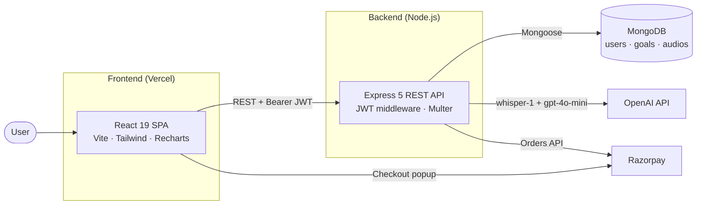
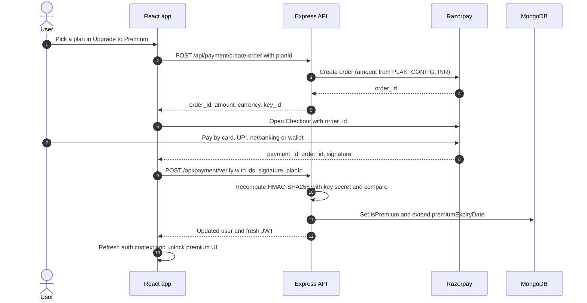
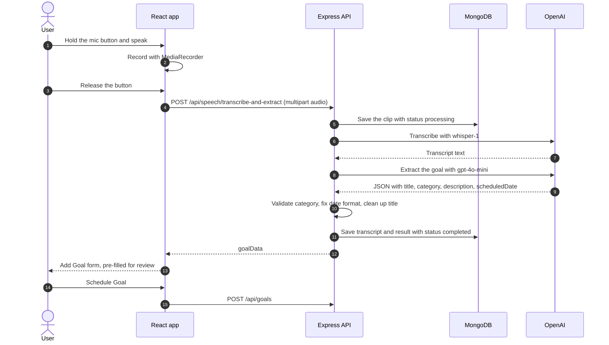

<p align="center">
  
</p>

<h1 align="center">GoGoals</h1>

<p align="center">
  A full-stack personal goal tracker. Plan goals for the day, week, month, year or "someday",<br/>
  watch your progress turn into scores and charts, and add new goals just by speaking.
</p>

<p align="center">
  
  
  
  
  
  
  
  
</p>

---

## Contents

- [Overview](#overview)
- [Features](#features)
- [Tech stack](#tech-stack)
- [Architecture](#architecture)
- [Project structure](#project-structure)
- [Getting started](#getting-started)
- [How it works](#how-it-works)
- [API reference](#api-reference)
- [Data models](#data-models)
- [Customizing](#customizing)
- [Deployment](#deployment)
- [Troubleshooting](#troubleshooting)
- [Further reading](#further-reading)
- [Author](#author)

---

## Overview

GoGoals turns plans into measurable progress. Every goal belongs to a time horizon: **a day, a week, a month, a year**, or **someday** (your bucket list). As you tick goals off, the dashboard gives each period a **score out of 10** and draws bar charts you can step back and forth through time.

Premium members can also **create goals by voice**. Hold the mic button and say something like *"Run a half marathon in March 2027"*. The backend transcribes the clip with **OpenAI Whisper**, turns it into a structured goal with **GPT-4o-mini**, and the app opens a pre-filled form for you to confirm. Premium is sold as one-time plans through **Razorpay**.

The repository holds two apps that run side by side:

- **`frontend/`**: a React 19 single-page app built with Vite and Tailwind CSS.
- **`backend/`**: an Express 5 REST API backed by MongoDB, which also talks to OpenAI and Razorpay.

---

## Features

### Plan
- **Five time horizons.** Daily, weekly, monthly, yearly and bucket-list goals, each scheduled with the matching date, week, month or year picker.
- **Quick actions.** Tap a dashboard card to see that period's goals, tick them off, delete them or quick-add a new one.
- **My Goals page.** Lists your goals for *any* day, week, month or year you pick.
- **Bucket list.** Open-ended "someday" goals with instant (optimistic) updates.

### Track
- **Score out of 10** for Today, This Week, This Month and This Year (`completed ÷ total × 10`).
- **Time-travel charts.** Weekly, monthly, yearly and 10-year bar charts. Step through history with ◀ ▶ or a two-finger trackpad swipe.
- **Motivational quotes** that fade in and out on the dashboard.

### Speak (Premium)
- **Voice-to-Goal.** Hold the mic, say the goal, release. Whisper transcribes it, GPT-4o-mini works out the title, category and date, and the goal form opens pre-filled so you can review it before saving.

### Upgrade
- **Razorpay Checkout** with four one-time plans. Orders are created on the server and payments are confirmed with an HMAC-SHA256 signature check. Buying again extends your expiry date.
- **Friendly locks.** Premium-only cards and charts are shown blurred. Tapping one shakes it, vibrates the phone (where supported) and shows a short toast.

### Account
- JWT sessions (30 days) and bcrypt-hashed passwords.
- Edit your name; upload, crop and remove a profile photo.
- Three-step account deletion (confirm → type a sentence → enter password) that also deletes all your goals.

### Responsive by design
- On desktop the dashboard scrolls vertically with floating ↑ / ↓ buttons.
- On phones, the landing page and dashboard become swipeable screens and charts open full-screen.
- Framer Motion animations throughout.

### Free vs Premium

| | Free | Premium |
|---|:---:|:---:|
| Create, complete and delete goals in all five categories | ✅ | ✅ |
| My Goals page and Bucket List | ✅ | ✅ |
| **Today** and **This Week** cards | ✅ | ✅ |
| **This Week** chart | ✅ | ✅ |
| **This Month** and **This Year** cards | 🔒 | ✅ |
| Monthly, yearly and 10-year charts | 🔒 | ✅ |
| Voice-to-Goal | 🔒 | ✅ |

| Plan | `planId` | Price | Charged (paise) | Saving vs monthly |
|---|---|---|---|---|
| 1 Month | `month1` | ₹500 | 50000 | — |
| 3 Months | `months3` | ₹1,400 | 140000 | 6.7 % |
| 6 Months | `months6` | ₹2,500 | 250000 | 16.7 % |
| 1 Year | `year1` | ₹4,800 | 480000 | 20 % |

---

## Tech stack

| Layer | Technology |
|---|---|
| UI | React 19, React Router 7, Tailwind CSS 4, Framer Motion 12, Lucide icons |
| Charts & media | Recharts 3, react-easy-crop 5, browser MediaRecorder API |
| Frontend tooling | Vite 8, ESLint 9 |
| HTTP & notifications | Axios, react-hot-toast |
| API | Node.js (ES modules), Express 5, CORS, dotenv |
| Auth | jsonwebtoken (JWT), bcrypt |
| Database | MongoDB (Atlas or local) with Mongoose 9 |
| File uploads | Multer (in-memory storage) |
| AI | OpenAI Node SDK: `whisper-1` for transcription, `gpt-4o-mini` for extraction |
| Payments | Razorpay Node SDK (Orders API) and Razorpay Checkout.js |
| Hosting | Vercel for the frontend; any Node.js host, such as Render, for the backend |

---

## Architecture



- **The API holds every secret.** MongoDB, OpenAI and Razorpay credentials live only in `backend/.env`. The browser only knows the API URL; it even gets the public Razorpay key ID from the API when a checkout starts.
- **Stateless auth.** Every protected request carries `Authorization: Bearer <JWT>`. The API verifies the token and loads the user on each call.
- **Three collections.** `users`, `goals`, and `audios` (voice clips, deleted automatically after 30 days).
- **Analytics run in the browser.** The dashboard loads your goals with a single request and computes every score and chart locally.

---

## Project structure

```text
GoGoals/
├── backend/                          Express 5 REST API
│   ├── config/
│   │   └── db.js                     MongoDB connection (+ DNS workaround for Atlas SRV lookups)
│   ├── controllers/
│   │   ├── authController.js         register, login, me, update name/photo, delete account
│   │   ├── goalController.js         goal CRUD (soft delete) and per-category progress stats
│   │   ├── paymentController.js      plan config, Razorpay order creation, signature verification
│   │   └── speechController.js       audio → Whisper → GPT-4o-mini → validated goal JSON
│   ├── middleware/
│   │   └── authMiddleware.js         `protect`: verifies the Bearer JWT and loads req.user
│   ├── models/
│   │   ├── User.js                   account + premium fields, bcrypt pre-save hook
│   │   ├── Goal.js                   category, period key, completed/deleted flags
│   │   └── Audio.js                  stored voice clips (30-day TTL index)
│   ├── routes/
│   │   ├── authRoutes.js             /api/auth/*
│   │   ├── goalRoutes.js             /api/goals/*
│   │   ├── paymentRoutes.js          /api/payment/*
│   │   └── speechRoutes.js           /api/speech/* (in-memory upload, 25 MB, audio types only)
│   ├── uploads/audio/                sample .m4a clip for trying the voice endpoint
│   ├── seedDummyData.js              inserts 50 sample goals for one user
│   ├── server.js                     entry point: CORS, body limits, routes, app.listen
│   ├── SPEECH_SETUP.md               early notes on the Whisper setup
│   ├── SPEECH_TO_GOAL_PIPELINE.md    notes on the voice prompt and date formats
│   └── package.json
├── frontend/                         React 19 + Vite single-page app
│   ├── public/logo.png               logo and favicon
│   ├── src/
│   │   ├── assets/                   logo and landing-page illustrations
│   │   ├── components/
│   │   │   ├── auth/                 LoginModal, SignupModal
│   │   │   ├── landing/              Navbar, HeroSection, FeaturesSection, CTASection, Footer
│   │   │   ├── routing/              ProtectedRoute
│   │   │   └── dashboard/
│   │   │       ├── DashboardNavbar.jsx        greeting, date, premium badge, profile menu
│   │   │       ├── StatCard.jsx               completed/total + score card (lockable)
│   │   │       ├── ChartBlock.jsx             bar chart with ◀ ▶ and trackpad swipe (lockable)
│   │   │       ├── GoalModal.jsx              current period's goals: tick, delete, quick add
│   │   │       ├── GoalCreateModal.jsx        "schedule a goal" form (also pre-filled by voice)
│   │   │       ├── GoalListSection.jsx        goal list + period picker used on My Goals
│   │   │       ├── BucketListModal.jsx        bucket list with optimistic updates
│   │   │       ├── PremiumUpgradeModal.jsx    plans + Razorpay Checkout flow
│   │   │       ├── SpeechRecordingButton.jsx  hold-to-record mic button
│   │   │       └── DashboardFooter.jsx
│   │   ├── context/AuthContext.jsx   token storage, /auth/me check, login/logout
│   │   ├── data/quotes.js            dashboard quotes
│   │   ├── hooks/usePremiumFeature.js  shake + vibrate + toast for locked features
│   │   ├── pages/                    routed pages: LandingPage, DashboardPage, MyGoalsPage, ProfilePage
│   │   ├── utils/
│   │   │   ├── chartHelpers.js       builds week / month / year / 10-year chart data
│   │   │   └── cropImage.js          canvas crop → JPEG data URL for profile photos
│   │   ├── App.jsx                   routes, public/protected guards, toast container
│   │   ├── index.css                 Tailwind import, base colors, shake animation
│   │   └── main.jsx                  React entry point
│   ├── index.html                    loads Razorpay Checkout.js
│   ├── eslint.config.js              ESLint flat config
│   ├── vercel.json                   SPA rewrite: every path → index.html
│   ├── vite.config.js                React + Tailwind plugins
│   └── package.json
└── PREMIUM_FEATURE_NOTIFICATIONS.md  notes on the locked-feature feedback
```

---

## Getting started

### Prerequisites

- **Node.js 20.19+ (or 22.12+) and npm.** Vite 8 and Mongoose 9 need it.
- **A MongoDB database.** A free [MongoDB Atlas](https://www.mongodb.com/atlas) cluster or a local MongoDB server.
- *Optional:* an **OpenAI API key** with billing enabled, for Voice-to-Goal.
- *Optional:* a **Razorpay account**, for Premium payments. Test-mode keys are enough for local development.

> Only MongoDB and a JWT secret are required to run the app. Without OpenAI or Razorpay keys everything else works; voice input and checkout simply return an error.

### 1. Clone the repository

```bash
git clone https://github.com/Ayush-Pratap-Tripathi/GoGoals.git
cd GoGoals
```

### 2. Set up the backend

```bash
cd backend
npm install
```

Create `backend/.env`:

```env
PORT=5000
MONGO_URI=mongodb+srv://<user>:<password>@<cluster>.mongodb.net/gogoals?retryWrites=true&w=majority
JWT_SECRET=<a-long-random-string>
OPENAI_API_KEY=sk-...
RAZORPAY_KEY_ID=rzp_test_...
RAZORPAY_KEY_SECRET=<razorpay-key-secret>
```

| Variable | Required | Used for |
|---|---|---|
| `PORT` | No (defaults to `5000`) | Port the API listens on |
| `MONGO_URI` | **Yes** | MongoDB connection string (server and seed script) |
| `JWT_SECRET` | **Yes** | Signing and verifying login tokens |
| `OPENAI_API_KEY` | For voice | Whisper transcription and GPT-4o-mini extraction |
| `RAZORPAY_KEY_ID` | For payments | Creating orders; also sent to the browser to open Checkout |
| `RAZORPAY_KEY_SECRET` | For payments | Creating orders and verifying payment signatures |

To generate a strong `JWT_SECRET`:

```bash
node -e "console.log(require('crypto').randomBytes(48).toString('hex'))"
```

Start the API:

```bash
npm run dev
```

You should see `Server running on port 5000` and `MongoDB Connected: <host>`. Opening <http://localhost:5000> returns `GoGoals API is running...`.

### 3. Set up the frontend

In a second terminal:

```bash
cd frontend
npm install
```

Optionally create `frontend/.env` to point the app at your API:

```env
VITE_API_BASE_URL=http://localhost:5000/api
```

If you skip this file, the app falls back to `http://localhost:5000/api`. Note that the value must end in `/api`.

```bash
npm run dev
```

Vite serves the app at <http://localhost:5173> and opens it in your browser.

### 4. Take it for a spin

1. Click **SignUp** on the landing page and create an account. You'll land on the dashboard.
2. Press the **+** button (bottom-left) to schedule a goal, or click the **Today** / **This Week** card to add and tick off goals for the current period.
3. Open the avatar menu (top-right) for **My Goals**, **Bucket List**, **Edit Profile** and **Upgrade to Premium**.
4. To try Premium locally, either:
   - pay with Razorpay **test keys**, using the UPI ID `success@razorpay` or one of Razorpay's [test cards](https://razorpay.com/docs/payments/payments/test-card-details/), or
   - set `isPremium` to `true` on your user document in MongoDB and reload the page.
5. With Premium on and `OPENAI_API_KEY` set, **hold** the mic button (bottom-right), say a goal, release, and review the pre-filled form.

### 5. Load sample data (optional)

[`backend/seedDummyData.js`](backend/seedDummyData.js) inserts 50 daily goals scheduled for **today** (every fourth one completed) for one existing user. It's handy for seeing the cards and charts with data.

1. Register an account in the app.
2. In `seedDummyData.js`, change the email in the `User.findOne({ email: ... })` call to that account's email.
3. From `backend/`, run:

   ```bash
   node seedDummyData.js
   ```

### Getting the service keys

<details>
<summary><b>MongoDB Atlas</b></summary>

1. Create a free cluster at [mongodb.com/atlas](https://www.mongodb.com/atlas).
2. **Database Access**: add a database user with a password.
3. **Network Access**: add your current IP. For a cloud-hosted backend, add the host's outbound IPs or `0.0.0.0/0`.
4. **Connect → Drivers**: copy the `mongodb+srv://…` string into `MONGO_URI` and fill in the password. Add a database name before the `?` (for example `…mongodb.net/gogoals?…`); otherwise MongoDB uses a database called `test`.

A local server works too: `MONGO_URI=mongodb://127.0.0.1:27017/gogoals`.

</details>

<details>
<summary><b>OpenAI</b> (Voice-to-Goal only)</summary>

Create a secret key at [platform.openai.com/api-keys](https://platform.openai.com/api-keys) and make sure the account has billing set up. The backend calls `whisper-1` for transcription and `gpt-4o-mini` for goal extraction.

</details>

<details>
<summary><b>Razorpay</b> (Premium payments only)</summary>

1. Sign up at [razorpay.com](https://razorpay.com) and switch the dashboard to **Test Mode**.
2. Generate API keys ([guide](https://razorpay.com/docs/payments/dashboard/account-settings/api-keys/)). Put the Key ID (`rzp_test_…`) and Key Secret in `backend/.env`.
3. In test mode, pay with the UPI ID `success@razorpay` or a [test card](https://razorpay.com/docs/payments/payments/test-card-details/).
4. For real payments, activate your Razorpay account and swap in the Live keys (`rzp_live_…`). No code changes are needed.

</details>

### Available scripts

| Folder | Command | What it does |
|---|---|---|
| `backend/` | `npm run dev` | Starts the API with nodemon (restarts on file changes) |
| `backend/` | `npm start` | Starts the API with plain Node |
| `backend/` | `node seedDummyData.js` | Inserts 50 sample goals for one user |
| `frontend/` | `npm run dev` | Vite dev server on port 5173 |
| `frontend/` | `npm run build` | Production build into `frontend/dist` |
| `frontend/` | `npm run preview` | Serves the production build locally |
| `frontend/` | `npm run lint` | Runs ESLint |

---

## How it works

### Pages

| Route | What's there | Access |
|---|---|---|
| `/` | Landing page (hero, features, call to action) with login and sign-up modals | Public. Logged-in users are redirected to `/dashboard` |
| `/dashboard` | Stat cards, charts, quotes, **+** button and mic button | Logged in |
| `/goals` | My Goals: browse and manage any day, week, month or year | Logged in |
| `/profile` | Name, profile photo, account deletion | Logged in |

**Bucket List** and **Upgrade to Premium** open as modals from the avatar menu.

### Authentication and sessions

1. The sign-up and login modals call `POST /api/auth/register` or `POST /api/auth/login`. Passwords are hashed with bcrypt (10 salt rounds) in a Mongoose `pre('save')` hook. The API returns the user plus a JWT signed with `JWT_SECRET` that expires in **30 days**.
2. [`AuthContext`](frontend/src/context/AuthContext.jsx) stores the token in `localStorage` (`userToken`). Whenever the token changes, including on every page load, it calls `GET /api/auth/me`. On success it loads the full user (including `isPremium`); on failure it logs out.
3. `ProtectedRoute` guards `/dashboard`, `/goals` and `/profile` and shows a pulsing logo while the token is being checked. `PublicRoute` sends logged-in visitors from `/` to `/dashboard`.
4. On the server, the [`protect`](backend/middleware/authMiddleware.js) middleware reads `Authorization: Bearer <token>`, verifies it, and attaches the user (without the password) to `req.user`. Updating or deleting a goal also checks that the goal belongs to that user.

### Goals and period keys

Every goal has a `category` and a `scheduledDate`. Instead of a timestamp, `scheduledDate` holds a **period key**: exactly the string the browser's native picker produces.

| Category | Picker | `scheduledDate` format | Example |
|---|---|---|---|
| `daily` | `<input type="date">` | `YYYY-MM-DD` | `2026-10-09` |
| `weekly` | `<input type="week">` | `YYYY-Www` (ISO-8601 week) | `2026-W41` |
| `monthly` | `<input type="month">` | `YYYY-MM` | `2026-10` |
| `yearly` | number field (2020–2100) | `YYYY` | `2026` |
| `bucket` | — | none | — |

Because these are plain strings, there is no UTC conversion and no "my goal moved to yesterday" time-zone bug. The dashboard works out the current keys from the browser's local clock, using the same ISO-week formula as `<input type="week">`, and matches strings. For example, a weekly goal counts toward **This Week** when its key equals the current week's key.

- Goals added from the dashboard without a date go into the current period.
- Deleting a goal is a **soft delete**: it sets `isDeleted: true`. The goal disappears from the app but stays in the database, and `GET /api/goals/progress` still reports it.

### Scores and charts

**Score = completed ÷ total × 10**, rounded to two decimals (0 when a period has no goals).

The dashboard loads your active goals with a single request (`GET /api/goals`) and builds every card and chart in the browser ([`chartHelpers.js`](frontend/src/utils/chartHelpers.js)). Moving between weeks or years never waits on the network.

| Chart | Bars | Each bar is the score of… | ◀ / ▶ moves by | Access |
|---|---|---|---|---|
| This Week | 7 (Mon–Sun) | daily goals on that day | 1 week | Free |
| This Month | one per day (28–31) | daily goals on that day | 1 month | Premium |
| This Year | 12 (Jan–Dec) | monthly goals in that month | 1 year | Premium |
| Yearly Progress | 10 (a 10-year window) | yearly goals for that year | 1 year | Premium |

Charts also respond to a two-finger horizontal trackpad swipe and slide in with a short animation. On phones, the four charts appear as thumbnails that open full-screen.

### Premium gating

Premium status comes from `user.isPremium`, which the app re-reads from `GET /api/auth/me` on every load. Locked cards and charts still render, but blurred under a lock overlay. Tapping a locked feature calls the [`usePremiumFeature`](frontend/src/hooks/usePremiumFeature.js) hook, which:

- adds the `animate-premium-shake` class for 600 ms (keyframes in `src/index.css`),
- vibrates the device for one second where the Vibration API exists,
- shows a one-second 🔒 toast.

After a successful payment, the navbar shows a **Premium** badge and the **Upgrade to Premium** menu item disappears.

### Payments with Razorpay



- **The server sets the price.** The amount comes from `PLAN_CONFIG` in [`paymentController.js`](backend/controllers/paymentController.js); the browser only sends a `planId`.
- **Signature check first.** Verification recomputes `HMAC_SHA256(order_id + "|" + payment_id, RAZORPAY_KEY_SECRET)` and compares it with Razorpay's signature before the database is touched.
- **Plans stack.** Buying again while still premium extends the current expiry date instead of restarting it.
- **No keys in the frontend.** `create-order` returns the public key ID together with the order.

### Voice-to-Goal pipeline



- **Upload.** The request is `multipart/form-data` with an `audio` file (up to 25 MB) and an optional `language` code; the app sends `en`. Multer keeps the file in memory and accepts only `audio/wav`, `audio/x-wav`, `audio/mpeg`, `audio/mp4`, `audio/x-m4a`, `audio/webm`, `audio/ogg` and `audio/flac`.
- **Storage.** Each clip is saved to the `audios` collection with its transcript, extracted data and status (`processing`, then `completed` or `failed`). A TTL index deletes clips 30 days after upload. The only disk write is a short-lived file in the OS temp folder for the OpenAI SDK to stream from; it is deleted right after transcription.
- **Extraction.** GPT-4o-mini gets a system prompt describing the five categories and their date formats, and must reply with JSON only. The server then:
  - parses the reply (if the model wraps the JSON in extra text, it extracts the `{…}` part),
  - requires a title and a valid category,
  - checks the date format for that category and repairs it where it can (for example, a full date on a monthly goal becomes `YYYY-MM`),
  - clears the date for bucket goals,
  - tidies the title by stripping lead-ins such as "I want to", "I need to" or "schedule", capped at 100 characters.
- **Review.** Nothing is saved automatically. The browser opens the Add Goal form pre-filled with the result, so you can edit it before clicking **Schedule Goal**.

### Profile and account

- **Name.** Saved with `PUT /api/auth/profile/name`.
- **Photo.**
  - The browser rejects images over 2 MB; the rest open in a round 1:1 cropper (react-easy-crop, zoom 1–3×).
  - [`cropImage.js`](frontend/src/utils/cropImage.js) draws the crop on a canvas and exports a JPEG data URL at 90 % quality.
  - That data URL is stored directly in `user.profilePicture`, which is why the API accepts JSON bodies up to 10 MB.
  - **Remove Picture** saves an empty string.
- **Delete account.** Three steps:
  1. Confirm.
  2. Type the exact sentence `I'm <your name> and I am deleting my account on GoGoals.`
  3. Enter your password.

  The API checks the password with bcrypt, deletes all your goals, then deletes your user record. A wrong password returns `401` and the app logs you out.

---

## API reference

- **Base URL:** `http://localhost:5000/api` in development. `GET /` (outside `/api`) returns `GoGoals API is running...` and works as a health check.
- **Auth:** 🔒 marks endpoints that need `Authorization: Bearer <token>`.
- **Errors:** responses are JSON `{ "message": "..." }` with a `400`, `401`, `404` or `500` status. The voice endpoint uses `{ "error": "..." }` instead, usually with a `details` or `message` field.

### Auth — `/api/auth`

| Method | Endpoint | Auth | Body | Returns |
|---|---|:---:|---|---|
| `POST` | `/auth/register` | | `name`, `email`, `password` | `201` user + `token` |
| `POST` | `/auth/login` | | `email`, `password` | user + `token` (`401` on bad credentials) |
| `GET` | `/auth/me` | 🔒 | — | current user (no password) |
| `PUT` | `/auth/profile/name` | 🔒 | `name` | user + fresh `token` |
| `PUT` | `/auth/profile/avatar` | 🔒 | `profilePicture` (data URL, or `""` to remove) | user + fresh `token` |
| `DELETE` | `/auth/profile` | 🔒 | `password` | deletes the user and all of their goals |

### Goals — `/api/goals`

| Method | Endpoint | Auth | Body | Returns |
|---|---|:---:|---|---|
| `GET` | `/goals` | 🔒 | — | all of the user's non-deleted goals |
| `POST` | `/goals` | 🔒 | `title`, `category` (required); `description`, `scheduledDate` | `201` created goal |
| `PUT` | `/goals/:id` | 🔒 | any goal fields, e.g. `{ "isCompleted": true }` | updated goal (owner only) |
| `DELETE` | `/goals/:id` | 🔒 | — | soft-deletes the goal |
| `GET` | `/goals/progress` | 🔒 | — | all-time stats per category: `score`, `totalTasksCreated`, `totalCompleted`, `totalDeleted`, `activeTasks` |

### Voice — `/api/speech`

| Method | Endpoint | Auth | Body | Returns |
|---|---|:---:|---|---|
| `POST` | `/speech/transcribe-and-extract` | 🔒 | multipart: `audio` file, optional `language` | `audioId`, `transcript`, `goalData`, `model` |

### Payments — `/api/payment`

| Method | Endpoint | Auth | Body | Returns |
|---|---|:---:|---|---|
| `POST` | `/payment/create-order` | 🔒 | `planId`: `month1`, `months3`, `months6` or `year1` | `order_id`, `amount`, `currency`, `key_id`, `planId`, `planLabel` |
| `POST` | `/payment/verify` | 🔒 | `razorpay_payment_id`, `razorpay_order_id`, `razorpay_signature`, `planId` | `success`, `message`, `user` (with a fresh `token`) |

<details>
<summary><b>Example requests</b> (bash / Git Bash)</summary>

```bash
# Register (or log in) and copy the token from the response
curl -s -X POST http://localhost:5000/api/auth/register \
  -H "Content-Type: application/json" \
  -d '{"name":"Jane Doe","email":"jane@example.com","password":"s3cret-pass"}'
# → { "_id": "...", "name": "Jane Doe", ..., "isPremium": false, "token": "eyJhbGciOi..." }

TOKEN="paste-the-token-here"

# Create a weekly goal
curl -s -X POST http://localhost:5000/api/goals \
  -H "Authorization: Bearer $TOKEN" -H "Content-Type: application/json" \
  -d '{"title":"Run three times","category":"weekly","scheduledDate":"2026-W41"}'

# Mark it as completed
curl -s -X PUT http://localhost:5000/api/goals/<goalId> \
  -H "Authorization: Bearer $TOKEN" -H "Content-Type: application/json" \
  -d '{"isCompleted":true}'

# All-time stats per category
curl -s http://localhost:5000/api/goals/progress -H "Authorization: Bearer $TOKEN"
# → [{ "category": "weekly", "score": "10.00", "totalTasksCreated": 1,
#      "totalCompleted": 1, "totalDeleted": 0, "activeTasks": 1 }]

# Voice → goal (run from the repository root).
# curl can't guess audio MIME types, so set it after the file path.
curl -s -X POST http://localhost:5000/api/speech/transcribe-and-extract \
  -H "Authorization: Bearer $TOKEN" \
  -F "audio=@backend/uploads/audio/1776630627428-8ssz2f.m4a;type=audio/mp4" \
  -F "language=en"
```

Example voice response:

```json
{
  "success": true,
  "audioId": "66f1c2a9e4b0c7d1a2b3c4d5",
  "transcript": "Run a half marathon in March 2027",
  "goalData": {
    "title": "Run a half marathon",
    "category": "monthly",
    "description": null,
    "scheduledDate": "2027-03"
  },
  "model": "whisper-1 + gpt-4o-mini"
}
```

</details>

---

## Data models

```js
// User (collection: users)
{
  name:              String,   // required
  email:             String,   // required, unique
  password:          String,   // bcrypt hash
  profilePicture:    String,   // JPEG data URL, '' when unset
  isPremium:         Boolean,  // default false
  premiumExpiryDate: Date,     // null until the first purchase
  createdAt, updatedAt
}

// Goal (collection: goals)
{
  user:          ObjectId,  // → User
  title:         String,    // required
  description:   String,    // default ''
  category:      String,    // 'daily' | 'weekly' | 'monthly' | 'yearly' | 'bucket'
  scheduledDate: String,    // period key: '2026-10-09', '2026-W41', '2026-10', '2026'; none for bucket goals
  isCompleted:   Boolean,   // default false
  isDeleted:     Boolean,   // default false (soft delete)
  createdAt, updatedAt
}

// Audio (collection: audios), one document per voice clip
{
  user:              ObjectId, // → User
  audioData:         Buffer,   // raw audio bytes
  mimeType:          String,   // one of the 8 allowed audio types
  originalFileName:  String,
  fileSize:          Number,   // bytes
  language:          String,   // default 'en'
  transcript:        String,   // Whisper output
  extractedGoalData: Mixed,    // validated GPT output
  processingStatus:  String,   // 'uploaded' | 'processing' | 'completed' | 'failed'
  processingError:   String,
  relatedGoal:       ObjectId, // → Goal (reserved for linking a clip to the goal it created)
  createdAt, updatedAt         // a TTL index removes the document 30 days after createdAt
}
```

---

## Customizing

| To change… | Edit |
|---|---|
| Plan prices and durations | `PLAN_CONFIG` in [`paymentController.js`](backend/controllers/paymentController.js) (amounts in paise) **and** the `plans` list in [`PremiumUpgradeModal.jsx`](frontend/src/components/dashboard/PremiumUpgradeModal.jsx), which is what users see |
| Which cards and charts are premium | The `isPremium` props passed to `StatCard` and `ChartBlock` in [`DashboardPage.jsx`](frontend/src/pages/DashboardPage.jsx) |
| Locked-feature feedback | Message, toast duration and vibration in [`usePremiumFeature.js`](frontend/src/hooks/usePremiumFeature.js); shake keyframes in [`index.css`](frontend/src/index.css) |
| How speech becomes a goal | The system prompt and validators in [`speechController.js`](backend/controllers/speechController.js) |
| Dashboard quotes | [`quotes.js`](frontend/src/data/quotes.js) |

---

## Deployment

### Frontend → Vercel

1. Import the repository in Vercel and set **Root Directory** to `frontend`. The Vite preset uses build command `npm run build` and output folder `dist`.
2. Add the environment variable `VITE_API_BASE_URL=https://<your-backend-host>/api`. Vite bakes it in at build time, so redeploy after changing it.
3. [`vercel.json`](frontend/vercel.json) rewrites every path to `index.html`, so refreshing `/dashboard` or `/goals` works.

### Backend → Render (or any Node.js host)

1. Create a **Web Service** from the repository with **Root Directory** `backend`, build command `npm install` and start command `npm start`.
2. Add `MONGO_URI`, `JWT_SECRET`, `OPENAI_API_KEY`, `RAZORPAY_KEY_ID` and `RAZORPAY_KEY_SECRET`. The host provides `PORT`.
3. In MongoDB Atlas **Network Access**, allow the host's outbound IPs (or `0.0.0.0/0`).
4. `server.js` starts a regular long-running server with `app.listen`, so it suits a web-service host. Free Render instances sleep when idle, so the first request after a break can take a while.

### Production checklist

- Serve the frontend over **HTTPS** (Vercel does this). Browsers only allow microphone access on secure origins.
- Switch the Razorpay keys to **Live** mode when you're ready to take real payments.
- CORS is open to all origins in `server.js`. You can restrict `origin` to your frontend's URL.

---

## Troubleshooting

| Problem | What to check |
|---|---|
| Backend stops right after starting with `Error: …` | `config/db.js` exits when MongoDB can't be reached. Check `MONGO_URI`, the database user's password and Atlas **Network Access**. |
| `querySrv ECONNREFUSED` / `ETIMEOUT` with a `mongodb+srv://` URI | `config/db.js` points Node's DNS resolver at Google DNS (`8.8.8.8`) to work around Windows failing to resolve Atlas SRV records. If your network blocks outside DNS servers, remove the `dns.setServers(...)` line or use Atlas's standard (non-SRV) connection string. |
| `401 Not authorized, token failed` | The token expired (30 days) or `JWT_SECRET` changed since it was issued. Log in again. |
| The app can't reach the API | `VITE_API_BASE_URL` must end in `/api`. Restart `npm run dev` after editing `.env`; on Vercel, redeploy. |
| Refreshing `/dashboard` on Vercel shows a 404 | Set the Vercel Root Directory to `frontend` so the `vercel.json` rewrite is used. |
| The mic button shows an error | Allow microphone access. Browsers only expose the mic on `https://` or `localhost`. |
| Voice returns `OPENAI_API_KEY not configured` | Add the key to `backend/.env` and restart the server. |
| Voice returns `Transcription failed` | The OpenAI key is invalid, out of credits or rate-limited. The `details` field has OpenAI's message. |
| Voice returns `Missing required fields in extracted data` | The clip didn't contain a recognizable goal. Speak one clear goal sentence. |
| A curl upload fails with `Invalid file type: application/octet-stream` | curl doesn't know audio MIME types. Add `;type=audio/mp4` (or the matching type) after the file path. |
| "Failed to initiate payment" | `RAZORPAY_KEY_ID` or `RAZORPAY_KEY_SECRET` is missing or wrong. Check the backend log. |
| Payment goes through but verification fails | The key ID and secret must be from the same key pair and the same mode (test or live). |
| The Razorpay popup never opens | `index.html` loads `https://checkout.razorpay.com/v1/checkout.js`; an ad or script blocker may be stopping it. |
| Week or month pickers look like plain text boxes | Some browsers have no native `week` / `month` input. Type values such as `2026-W41` or `2026-10`. |

---

## Further reading

- [`backend/SPEECH_TO_GOAL_PIPELINE.md`](backend/SPEECH_TO_GOAL_PIPELINE.md): how spoken phrases map to categories and date formats.
- [`PREMIUM_FEATURE_NOTIFICATIONS.md`](PREMIUM_FEATURE_NOTIFICATIONS.md): design notes on the locked-feature feedback (shake, vibration, toast).

---

## Author

**Ayush Pratap Tripathi** · [@Ayush-Pratap-Tripathi](https://github.com/Ayush-Pratap-Tripathi)

Issues and pull requests are welcome. If you find GoGoals useful, consider giving the repo a ⭐.
